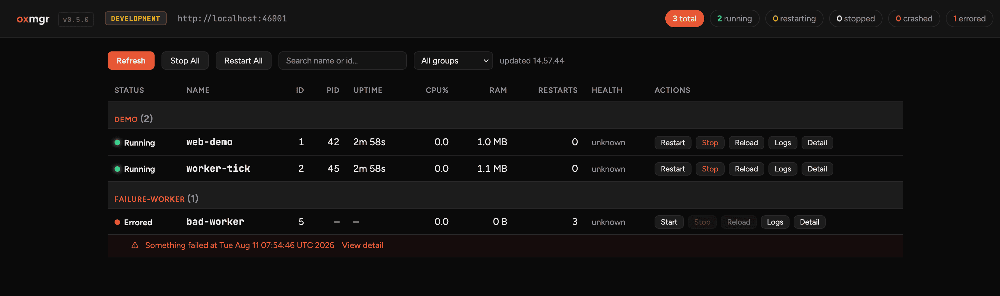
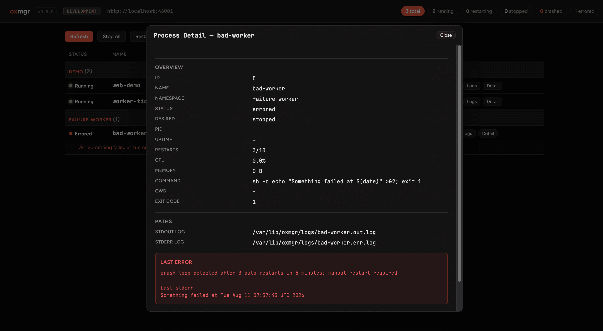
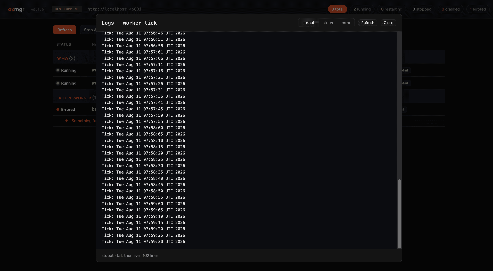

# Oxmgr

[](https://github.com/Vladimir-Urik/OxMgr/actions/workflows/ci.yml)
[](https://github.com/Vladimir-Urik/OxMgr/releases)
[](./LICENSE)

Oxmgr is a lightweight, cross-platform Rust process manager and PM2 alternative.

Use it to run, supervise, reload, and monitor long-running services on Linux, macOS, and Windows. Oxmgr is language-agnostic, so it works with Node.js, Python, Go, Rust binaries, and shell commands.

Latest published benchmark snapshots: [BENCHMARK.md](./BENCHMARK.md) and [benchmark.json](./benchmark.json)



## Why Oxmgr

- Language-agnostic: manage any executable, not just Node.js apps
- Cross-platform: Linux, macOS, and Windows
- Low overhead: Rust daemon with persistent local state
- Practical operations: restart policies, health checks, logs, and CPU/RAM metrics
- Foreground runtime mode for containers: `oxmgr runtime` (pm2-runtime style)
- Config-first workflows with idempotent `oxmgr apply`
- PM2 ecosystem compatibility via `ecosystem.config.{js,cjs,mjs,json}`
- Interactive terminal UI with live search, filters, and sort controls

## Core Features

- Start, stop, restart, reload, and delete managed processes
- Foreground runtime command for Docker/Kubernetes (`oxmgr runtime`)
- Named services and namespaces
- Restart policies: `always`, `on-failure`, and `never`
- Health checks with automatic restart on repeated failures
- Config-driven file watch with ignore patterns and restart debounce
- Log tailing, log rotation, and per-process stdout/stderr logs
- Readiness-aware reloads using health checks
- Git pull and webhook-driven update workflow
- Interactive terminal UI with live search, status filters, and CPU/RAM/restart sorting
- Import and export bundles with `.oxpkg`
- Service installation for `systemd`, `launchd`, and Windows Task Scheduler

## Install

### npm

```bash
npm install -g oxmgr
```

### Homebrew

```bash
brew tap empellio/homebrew-tap
brew install oxmgr
```

### Scoop

```powershell
scoop bucket add oxmgr https://github.com/empellio/scoop-bucket
scoop install oxmgr/oxmgr
```

Windows package-manager channels are currently `Scoop` and `npm`.

### AUR (Arch Linux)

```bash
yay -S oxmgr-bin
```

### APT (Debian/Ubuntu)

```bash
echo "deb [trusted=yes] https://vladimir-urik.github.io/OxMgr/apt stable main" | sudo tee /etc/apt/sources.list.d/oxmgr.list
sudo apt update
sudo apt install oxmgr
```

### Build from source

```bash
git clone https://github.com/Vladimir-Urik/OxMgr.git
cd OxMgr
cargo build --release
./target/release/oxmgr --help
```

For signed APT setup, local installation, and platform-specific notes, see [docs/install.md](./docs/install.md).

## Quick Start

Start a service:

```bash
oxmgr start "node server.js" --name api --restart always
```

Inspect and operate it:

```bash
oxmgr list
oxmgr status api
oxmgr logs api -f
oxmgr ui
```

Inside `oxmgr ui`, use `/` for live search, `f` to cycle status filters, and `o` to cycle sort order.

### Web dashboard

Open the web dashboard in your browser:

```bash
oxmgr ui web
```

Or manually navigate to `http://127.0.0.1:46001` while the daemon is running.

The dashboard shows process status, CPU/RAM usage, health, and log tails, and
lets you stop, restart, or reload processes from the browser. Override the API
bind address with the `OXMGR_API_ADDR` environment variable (see
[src/config.rs](./src/config.rs)).





### Docker demo

A ready-to-run demo image ships with a web dashboard and an example config:

```bash
docker compose up --build
# open http://localhost:46001
# the example managed web service is at http://localhost:8080
```

The `docker-compose.yaml` seeds the daemon with `docker/oxfile.example.toml`
(three demo services: a web responder, a log ticker, and one that crashes so
you can see error handling), and persists state in a named volume. See the
[Dockerfile](./Dockerfile) for image layout and environment overrides.

Use a config file for repeatable setups:

```toml
version = 1

[[apps]]
name = "api"
command = "node server.js"
restart_policy = "on_failure"
max_restarts = 10
stop_timeout_secs = 5
```

```bash
oxmgr validate ./oxfile.toml
oxmgr apply ./oxfile.toml
oxmgr apply ./core.toml ./worker.toml
```

Container-style foreground mode:

```bash
oxmgr runtime ./oxfile.toml
oxmgr runtime ./ecosystem.config.js
```

## PM2 Migration

Oxmgr supports PM2-style `ecosystem.config.{js,cjs,mjs,json}`, including config-driven watch settings and readiness-aware reload fields, which makes it easier to move existing PM2 setups without rewriting everything on day one.

Useful links:

- [Oxfile vs PM2 Ecosystem](./docs/OXFILE_VS_PM2.md)
- [Oxfile Specification](./docs/OXFILE.md)

## Documentation

- [Documentation Index](./docs/README.md)
- [AI Skill Reference (experimental)](./docs/SKILL.md) — drop this into your project so your AI assistant (Claude, Cursor, Codex, …) knows how to help you configure and use Oxmgr
- [Latest Benchmark Results](./BENCHMARK.md)
- [Latest Benchmark JSON](./benchmark.json)
- [Architecture Overview](./docs/ARCHITECTURE.md)
- [Installation Guide](./docs/install.md)
- [User Guide](./docs/USAGE.md)
- [CLI Reference](./docs/CLI.md)
- [Terminal UI Guide](./docs/UI.md)
- [Runtime Mode (pm2-runtime style)](./docs/RUNTIME.md)
- [Pull, Webhook, and Metrics Guide](./docs/PULL_WEBHOOK.md)
- [Deployment Guide](./docs/DEPLOY.md)
- [Service Bundles](./docs/BUNDLES.md)
- [Benchmark Guide](./docs/BENCHMARKS.md)
- [Examples](./docs/examples)

## Contributing

Issues, PRs, and documentation improvements are welcome. Start with [CONTRIBUTING.md](./CONTRIBUTING.md) for local setup, checks, and testing expectations.

## Community

Oxmgr is created and maintained by **Vladimír Urík**.

The project is developed under the open-source patronage of [Empellio](https://empellio.com).

## License

[MIT](./LICENSE)

## Star History


<a href="https://www.star-history.com/?repos=Vladimir-Urik%2FOxMgr&type=date&legend=top-left">
 <picture>
   <source media="(prefers-color-scheme: dark)" srcset="https://api.star-history.com/chart?repos=Vladimir-Urik/OxMgr&type=date&theme=dark&legend=top-left&sealed_token=Mfct7NOpErmiOGiI0Yq6yxsyxPXTkv1dxj4ypDwjdESSMN_yPazaW36Po6u7ABTgxmQJo5AASxKB4Iwtkm_JYnYFC2xw7tSihpUx5163tR7Pb5IonpWPIg" />
   <source media="(prefers-color-scheme: light)" srcset="https://api.star-history.com/chart?repos=Vladimir-Urik/OxMgr&type=date&legend=top-left&sealed_token=Mfct7NOpErmiOGiI0Yq6yxsyxPXTkv1dxj4ypDwjdESSMN_yPazaW36Po6u7ABTgxmQJo5AASxKB4Iwtkm_JYnYFC2xw7tSihpUx5163tR7Pb5IonpWPIg" />
   
 </picture>
</a>
